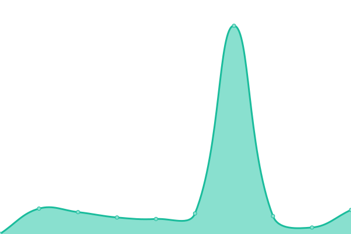
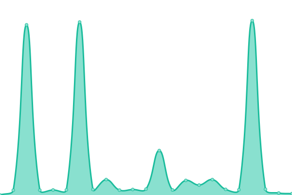

# [📈 Live Status](https://williambargent-org.github.io/williambargent-org.github.com): <!--live status--> **🟧 Partial outage**

This repository contains the open-source uptime monitor and status page for [William Bargent](https://williambargent.co.uk), powered by [Upptime](https://github.com/upptime/upptime).

With [Upptime](https://upptime.js.org), you can get your own unlimited and free uptime monitor and status page, powered entirely by a GitHub repository. We use [Issues](https://github.com/williambargent-org/williambargent-org.github.com/issues) as incident reports, [Actions](https://github.com/williambargent-org/williambargent-org.github.com/actions) as uptime monitors, and [Pages](https://williambargent-org.github.io/williambargent-org.github.com) for the status page.

<!--start: status pages-->
<!-- This summary is generated by Upptime (https://github.com/upptime/upptime) -->
<!-- Do not edit this manually, your changes will be overwritten -->
<!-- prettier-ignore -->
| URL | Status | History | Response Time | Uptime |
| --- | ------ | ------- | ------------- | ------ |
|  [Website](https://williambargent.co.uk) | 🟩 Up | [website.yml](https://github.com/williambargent-org/williambargent-org.github.com/commits/HEAD/history/website.yml) | 

 1048ms
     
 | 

<a href="https://status.williambargent.co.uk/history/website">98.04%</a>
    

|  [Blog](https://williambargent.co.uk/blog/) | 🟩 Up | [blog.yml](https://github.com/williambargent-org/williambargent-org.github.com/commits/HEAD/history/blog.yml) | 

 375ms
     
 | 

<a href="https://status.williambargent.co.uk/history/blog">100.00%</a>
    

|  [WeatherMX](https://weathermx.williambargent.co.uk) | 🟩 Up | [weather-mx.yml](https://github.com/williambargent-org/williambargent-org.github.com/commits/HEAD/history/weather-mx.yml) | 

 396ms
     
 | 

<a href="https://status.williambargent.co.uk/history/weather-mx">100.00%</a>
    

|  [Identity](https://identity.williambargent.co.uk/idp/logout.php) | 🟥 Down | [identity.yml](https://github.com/williambargent-org/williambargent-org.github.com/commits/HEAD/history/identity.yml) | 

 213ms
     
 | 

<a href="https://status.williambargent.co.uk/history/identity">0.00%</a>
    

|  [Gallery](https://gallery.williambargent.co.uk) | 🟩 Up | [gallery.yml](https://github.com/williambargent-org/williambargent-org.github.com/commits/HEAD/history/gallery.yml) | 

 483ms
     
 | 

<a href="https://status.williambargent.co.uk/history/gallery">100.00%</a>
    

<!--end: status pages-->

[**Visit our status website →**](https://williambargent-org.github.io/williambargent-org.github.com)

## 📄 License

- Powered by: [Upptime](https://github.com/upptime/upptime)
- Code: [MIT](./LICENSE) © [William Bargent](https://williambargent.co.uk)
- Data in the `./history` directory: [Open Database License](https://opendatacommons.org/licenses/odbl/1-0/)
